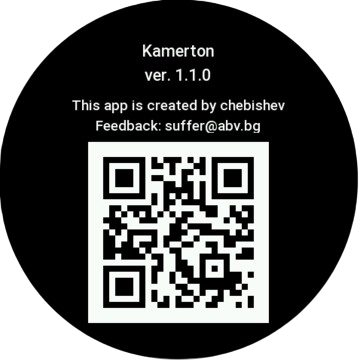

# Kamerton 
A tuning fork APP for ZEPP OS

## Description
Plays real, progressively fading out "A" note 440Hz

## Features
- Tap to start
(starts A-440Hz.mp3 tune)
- Tap to stop
- Tap on Info icon to visit About page

## Supported devices
- Compatible with Api level 3.0+ Round and Square devices
- Tested on real devices: Balance and Balance 2 (Round(480x480)) 
- Tested on emulators: Balance, Balance 2 (Round(480x480)), GTS 4 (Square(390x450)), Bip Max (Square(432×514))

## Audio
- Sound: Tuning Fork 440 Hz, Resonance Box (Long-decay, Tuning-fork, 440hz sound effect. Free for use.)
- Artist: jmuehlhans
- WebSite: https://pixabay.com/sound-effects/film-special-effects-tuning-fork-440-hz-resonance-box-22406/

## Project structure
```
.
├── page/
│   └── gt/home       # Contains the pages index.js and about.js, and layouts (round/square) for them
│   └── i18n/         # en_US.po file with info strings (title, version, author, email)
├── assets/           # Media files
    └── gt.r/         # icons and pictures for Round devices
    └── gt.s/         # icons and pictures for Square devices
    └── raw/media     # sound files (in this case - sound file)
```
## Screenshots



## License
[MIT](LICENSE)